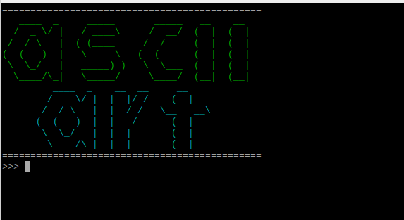

pyasciiart
===========
Class for handling ascii art strings

Info
===========
It provides basic support for creating and performing ascii art strings: For now it handles:

- concatenation ( __add__ )
- multiplication ( __mul__ )
- print function ( print() )

Install
===========

.. code-block:: python

    git clone https://github.com/streanger/pyasciiart.git
    python3 -m pip install -r requirements.txt
    
    
Usage from python
===========

.. code-block:: python

    from pyasciiart import art

    line = '=='*23
    banner_top = colored(art('ascii'), 'green')
    banner_bottom = colored(art(' art'), 'cyan')
    banner = '{}\n{}\n{}\n{}'.format(line, banner_top, banner_bottom, line)
    print(banner)
    
    
Example of ascii art string
===========

